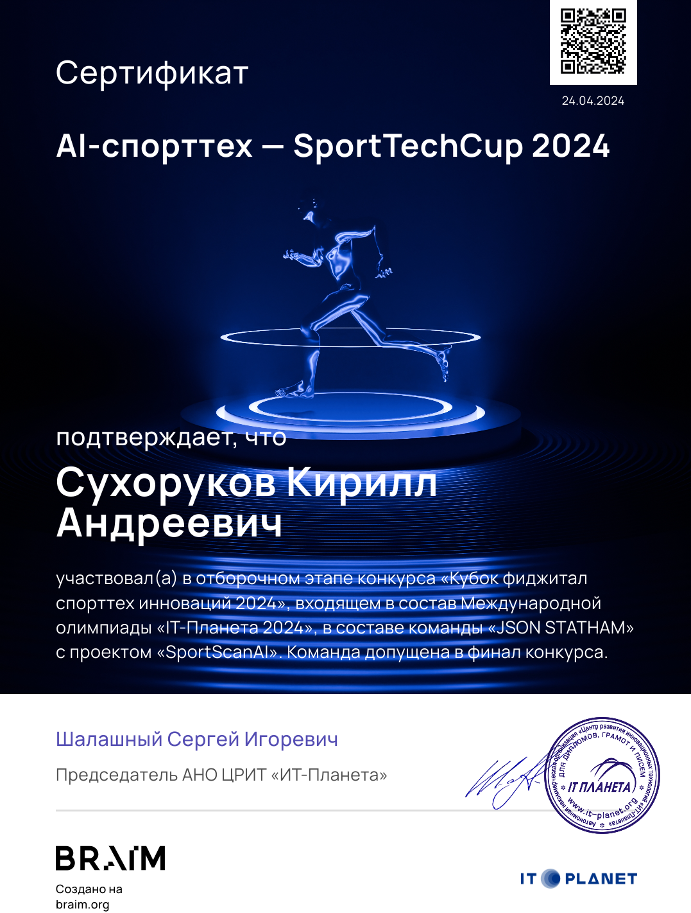
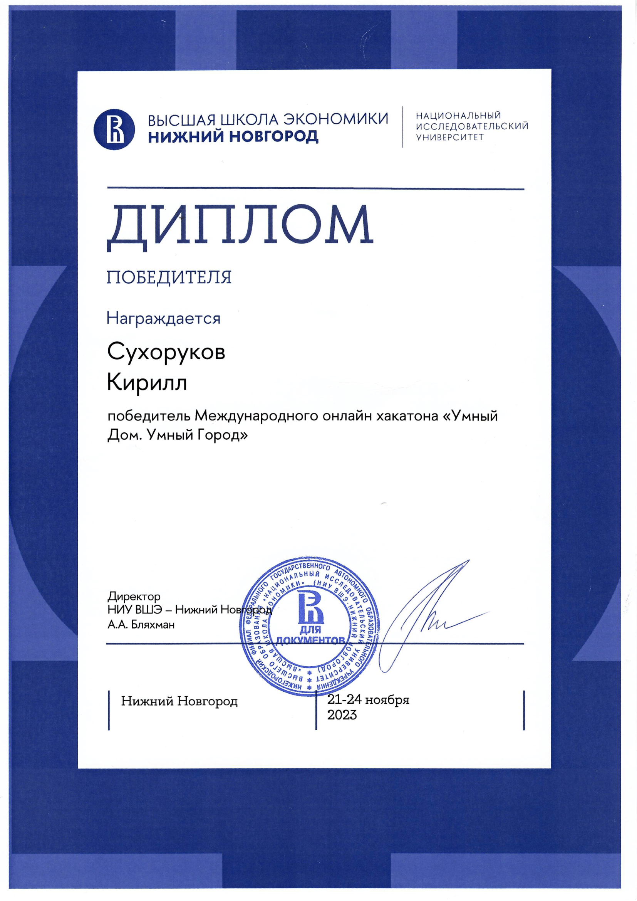
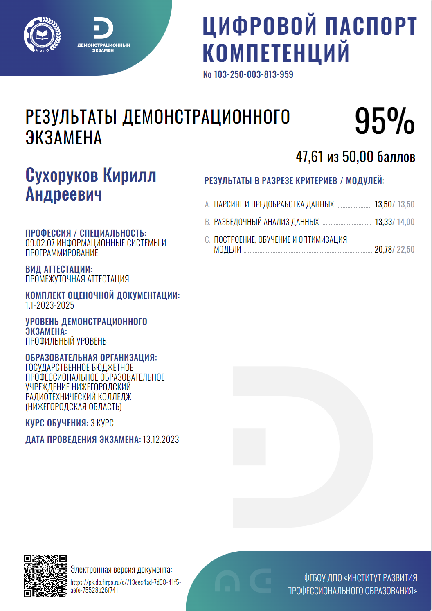

    

 
 

    
<h2>  Briefly about me </h2>

    
 I am an intern Data Scientist   from Nizhny Novgorod.

    
    <h3>   A little more detail: </h3>
    <ul>
        <li><a>&nbsp; I am a college student, studying to be a programmer.</a></li> 
        <li><a>&nbsp;  I actively participate in IT events.</a></li> 
        <li><a>&nbsp; I am actively involved in sports.</a></li> 
        <li><a>&nbsp; I am always learning something new.</a></li> 
    </ul>
 

<h2 > Social Media </h2>

    
    
    
    

 

  

    
<h2> Favorite languages and Tools </h2>

    

 
    
      
      
    
     
     
      
    
    
     
    
    
     
    
       

<h2>Other Languages and Tools </h2>

    

 
    
    
    
    
    
    
    
    

    
    
    
    
    
    
    
     
    

<h2> My various diplomas, certificates </h2>

  

      
      
      
      
      
      
      
      
      
      
      
      
      
      
      
      
      
      
      
      
  

     

<h2>  Profile Statistics </h2>

  

    
      
<!--        -->
  

  

      
  
  
  

 

<b>Visitors Count</b>
  

 

 

 

